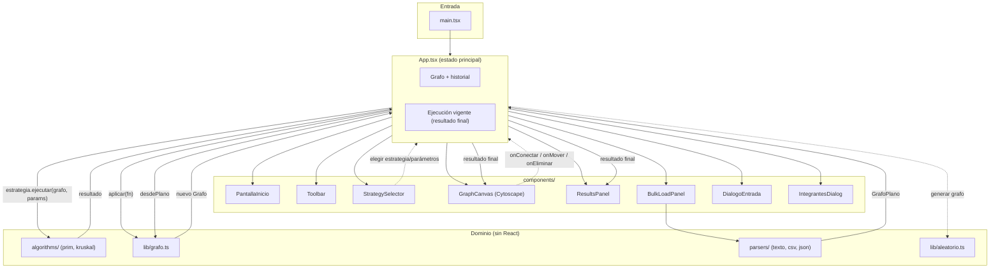
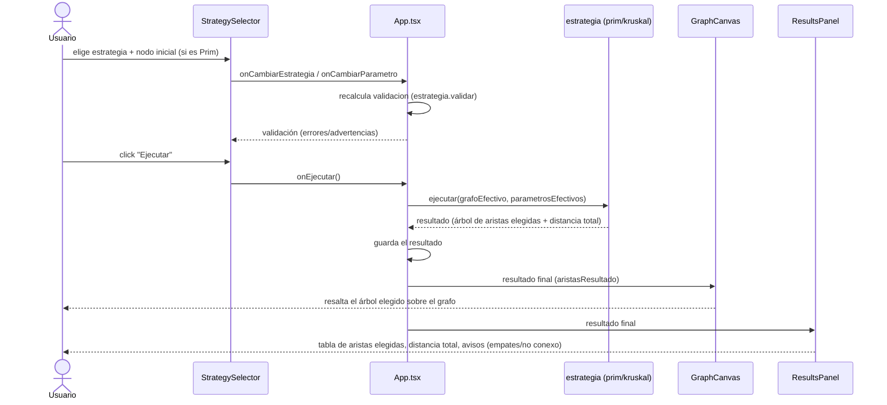
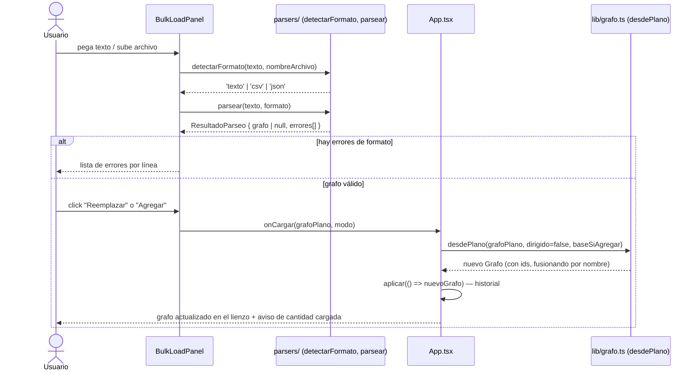
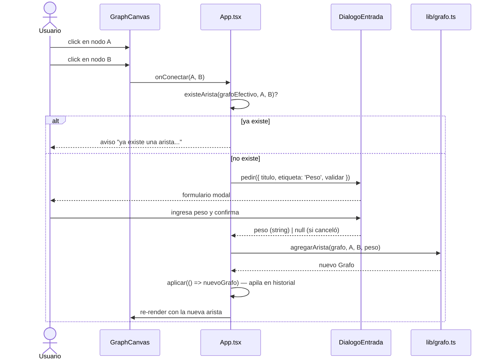

# Diagramas

## Diagrama de componentes

Muestra cómo se relacionan los módulos principales. `App.tsx` es el
orquestador: sostiene el estado y conecta la UI con la capa de dominio
(algoritmos, grafo, parsers).

**Lectura rápida:**
- Las flechas sólidas son dependencias de import/uso normal.
- Las flechas punteadas son callbacks/eventos que suben desde un componente
  hijo hacia `App.tsx`.
- Todo lo que está en **dominio** no importa nada de React: son los módulos
  más fáciles de testear en aislamiento (y son los que efectivamente tienen
  tests en `*.test.ts`).

---

## Diagrama de secuencia — ejecutar un algoritmo

Caso de uso UC-4.2: la persona usuaria elige una estrategia (Prim o Kruskal) y
toca "Ejecutar"; el resultado final aparece de inmediato.

---

## Diagrama de secuencia — carga masiva de un grafo

Caso de uso UC-3.1 a UC-3.6: pegar texto y confirmar la carga.

---

## Diagrama de secuencia — edición manual de una arista

Caso de uso UC-2.3: conectar dos nodos a mano.

