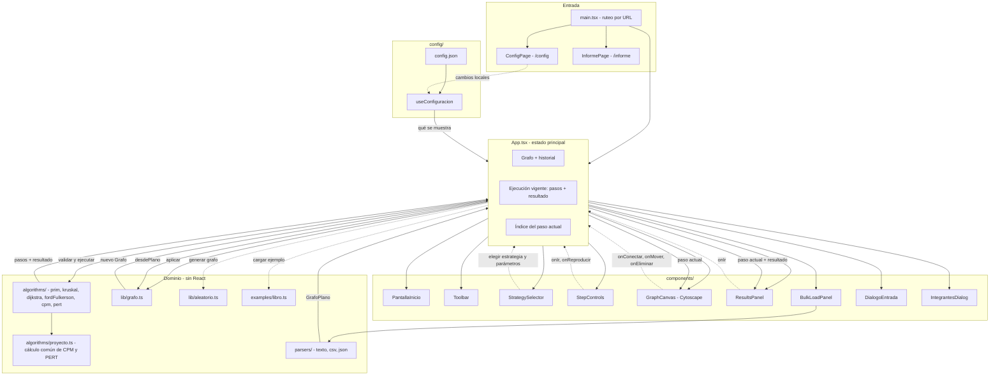
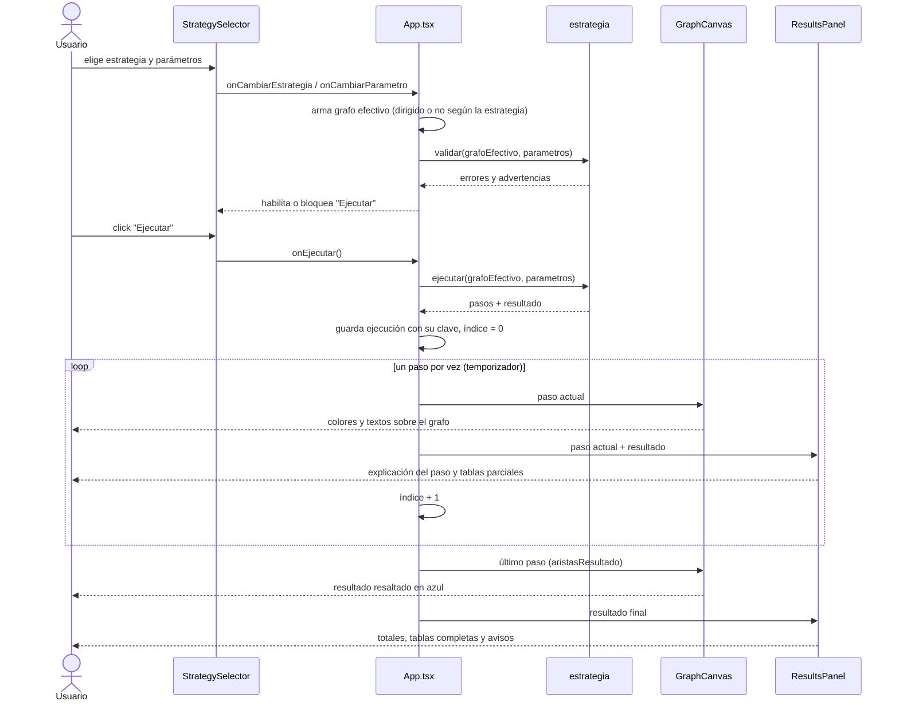
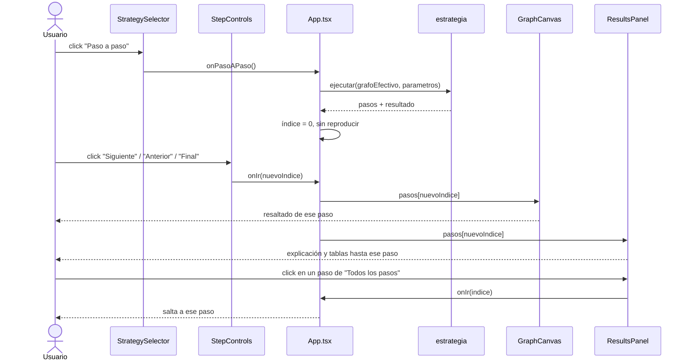
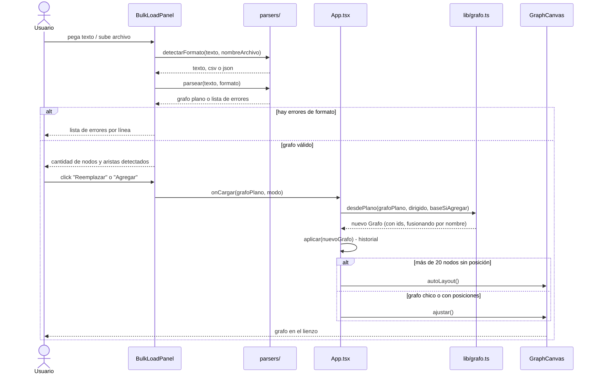
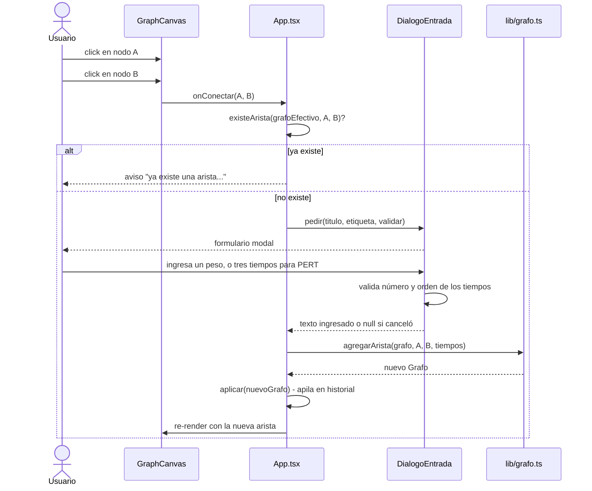
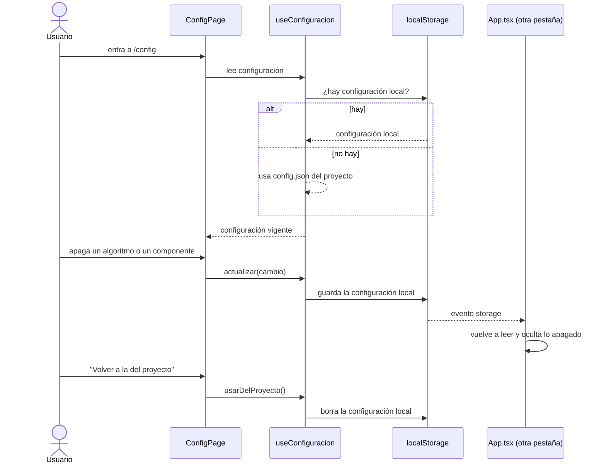

# Diagramas

## Diagrama de componentes

Muestra cómo se relacionan los módulos principales. `App.tsx` es el
orquestador: sostiene el estado y conecta la UI con la capa de dominio
(algoritmos, grafo, parsers).

**Lectura rápida:**
- Las flechas sólidas son dependencias de import/uso normal.
- Las flechas punteadas son callbacks/eventos que suben desde un componente
  hijo hacia `App.tsx`.
- Todo lo que está en **dominio** no importa nada de React: son los módulos
  más fáciles de testear en aislamiento (y son los que efectivamente tienen
  tests en `*.test.ts`).
- La configuración solo decide **qué se muestra**; nunca cambia un resultado.

---

## Diagrama de secuencia — ejecutar un algoritmo

Casos de uso UC-4.1 a UC-4.6: la persona usuaria elige una estrategia y toca
"Ejecutar". El algoritmo se calcula una sola vez; lo que se anima es el índice
del paso.

---

## Diagrama de secuencia — avanzar paso a paso

Caso de uso UC-4.3: ir y volver por los pasos no recalcula nada.

---

## Diagrama de secuencia — carga masiva de un grafo

Caso de uso UC-3.1 a UC-3.7: pegar texto y confirmar la carga.

---

## Diagrama de secuencia — edición manual de una arista

Caso de uso UC-2.3 y UC-2.5: conectar dos nodos a mano.

---

## Diagrama de secuencia — configuración

Caso de uso UC-6: qué algoritmos y componentes se muestran.

